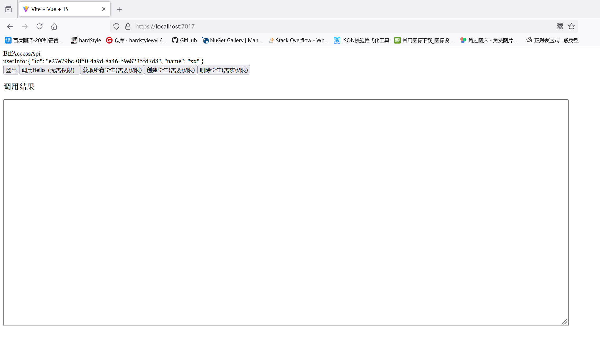

# SPA_BFF_Template

#### 介绍
.net对Spa应用支持的BFF层应用，提供Cors CSP XSS防护机制。轻松适配Vite构建的web应用
该分支集成Yarp以及Openiddict搭建的身份服务，提供了前端应用通过Bff来访问受限制资源的案例

#### 安装教程
1.  安装pnpm
2.  进入 src/Client目录运行 pnpm i
3.  安装好依赖后 src/Client目录运行 pnpm run dev
4.  dotnet restore
5.  启动 src/Server下的VueBffProxy.Server,OpeniddictServer,ResourceServer 这三个项目(注意使用配置中的https启动)
6.  访问 https://localhost:7017/

#### 使用说明

1.  进入应用主页面

2.  点击登录跳转到授权服务界面，点击红框按钮注册一个账户

    注册界面

3.  注册成功后就会跳转同意界面,点击yes即可

4.  登录成功入下图所示

#### 注意事项
1.若误操作出现了问题，请及时清除浏览器缓存重新测试
2.使用项目下launchSettings.json下的https配置可以直接正常启动
